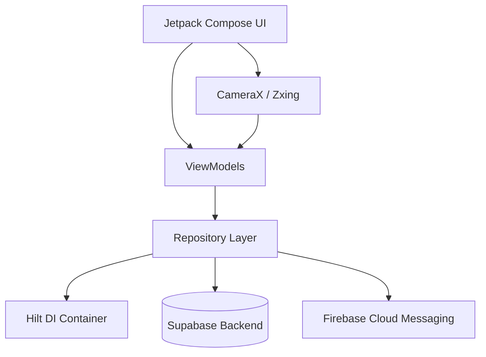
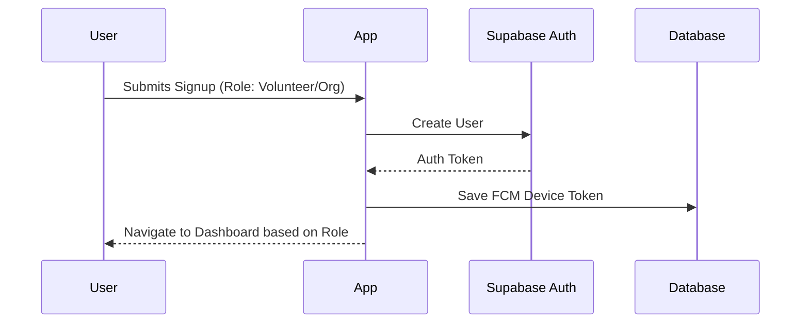
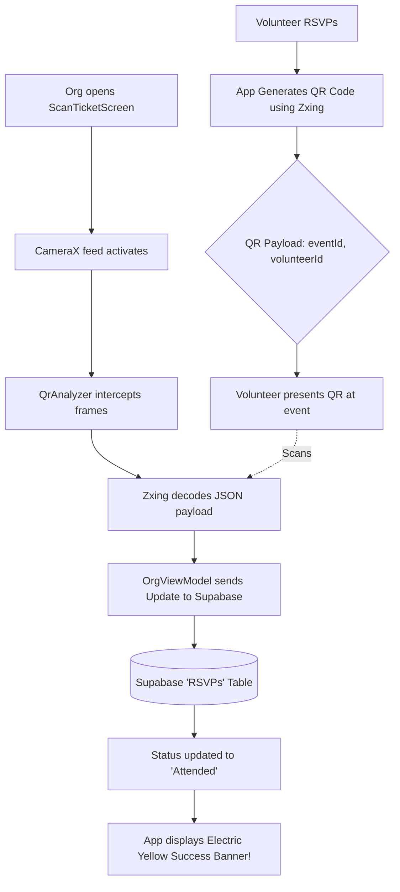

# BaseCamp: The Volunteering App 🏕️

BaseCamp is a high-energy, modern platform designed to bridge the gap between passionate **Volunteers** and community-driven **Organizations**. 

Built entirely with a strict **Neo-Brutalist** design language, BaseCamp rejects the standard, overly-polished corporate aesthetics in favor of raw, bold, and unapologetic UI components. With gamified profiles, instant QR-code ticketing, and real-time hardware scanning, BaseCamp makes community service engaging and frictionless.

---

## 🎯 Why did we make it?

Currently in India, there is no dedicated platform for companies or organizations to find volunteers—nor is there a reliable platform for individuals to find local events where they can volunteer. 

The existing ecosystem relies heavily on:
1. **Word-of-mouth** and personal referrals.
2. **WhatsApp channels** that send out irregular, disorganized, and vague updates regarding volunteering events.

BaseCamp was created to fix this fragmentation. We provide a centralized, common platform for both parties. By making the onboarding process incredibly easy, fun, and highly engaging through our Neo-Brutalist design, BaseCamp aims to solve the volunteering disconnect in India—while building a scalable foundation for future monetization.

---

## ⚙️ How Does It Work?

BaseCamp operates on a dual-role system:

### For Volunteers 🤝
1. **Discover**: Browse a real-time feed of local events categorized by cause (Environment, Health, Education, etc.).
2. **RSVP & Ticketing**: RSVP with a single tap. The app instantly generates a unique **QR Code Ticket** containing your secure payload.
3. **Check-In**: Show your digital ticket at the event to be scanned.
4. **Gamification**: Post-event, watch your "Total Hours" climb and unlock achievement badges on your Volunteer Dossier.

### For Organizations 🏢
1. **Event Creation**: Use brutalist forms to easily spin up new community events.
2. **Hardware Scanning**: Access the built-in CameraX scanner to scan volunteer QR tickets at the door.
3. **Real-time Sync**: Scanned tickets instantly update the volunteer's RSVP status to "Attended" in the Supabase backend.

---

## 🛠 Tech Stack

BaseCamp is built using a modern, scalable Android architecture:

*   **Language**: [Kotlin](https://kotlinlang.org/)
*   **UI Toolkit**: [Jetpack Compose](https://developer.android.com/jetpack/compose) (Custom Neo-Brutalist Modifiers)
*   **Architecture**: MVVM (Model-View-ViewModel)
*   **Dependency Injection**: [Dagger Hilt](https://dagger.dev/hilt/)
*   **Routing**: Jetpack Navigation Compose
*   **Backend as a Service (BaaS)**: [Supabase](https://supabase.com/) (PostgreSQL, Authentication) via the official Kotlin SDK.
*   **Hardware Integration**: [Android CameraX](https://developer.android.com/training/camerax) & [Zxing Core](https://github.com/zxing/zxing) for real-time QR generation and decoding.
*   **Push Notifications**: Firebase Cloud Messaging (FCM)

---

## 🗺️ System Flowcharts

### 1. High-Level Architecture


### 2. User Authentication Flow


### 3. The Ticketing & Hardware Scanning Flow


---

## 🚀 Local Setup & Installation

If you want to clone this repository and run BaseCamp locally, follow these steps to set up your environment and database!

### 1. Supabase Backend Setup
You will need a free [Supabase](https://supabase.com/) project to act as the backend.
1. Create a new project in Supabase.
2. Go to the **SQL Editor** and run the following queries to build your tables and set up security:

```sql
-- 1. Create Users Table
create table public.users (
  id uuid primary key references auth.users(id),
  created_at timestamp with time zone default now(),
  name text not null,
  role text not null check (role in ('Volunteer', 'Organization')),
  email text not null,
  phone text,
  website text
);

-- Enable RLS on users
alter table public.users enable row level security;
create policy "Users can view all users" on public.users for select using (true);
create policy "Users can insert their own profile" on public.users for insert with check (auth.uid() = id);


-- 2. Create Events Table
create table public.events (
  id uuid primary key default gen_random_uuid(),
  created_at timestamp with time zone default now(),
  org_id uuid not null references public.users(id),
  title text not null,
  description text,
  cause text not null,
  location text not null,
  date text not null,
  org_name text not null,
  max_volunteers integer default 0
);

-- Enable RLS on events
alter table public.events enable row level security;
create policy "Anyone can view events" on public.events for select using (true);
create policy "Organizations can create events" on public.events for insert with check (auth.uid() = org_id);
create policy "Organizations can update their own events" on public.events for update using (auth.uid() = org_id);
create policy "Organizations can delete their own events" on public.events for delete using (auth.uid() = org_id);


-- 3. Create Tickets Table
create table public.tickets (
  id uuid primary key default gen_random_uuid(),
  created_at timestamp with time zone default now(),
  event_id uuid not null references public.events(id) on delete cascade,
  volunteer_id uuid not null references public.users(id),
  status text default 'Pending'
);

-- Enable RLS on tickets
alter table public.tickets enable row level security;
create policy "Anyone can view tickets" on public.tickets for select using (true);
create policy "Volunteers can create tickets" on public.tickets for insert with check (auth.uid() = volunteer_id);
create policy "Organizations can update ticket status" on public.tickets for update using (true);
```

### 2. Configure Local API Keys
For security, Supabase keys are not checked into GitHub. You must add them to a `local.properties` file.

1. Open the Android Studio project.
2. In the root directory of the project, open (or create) the `local.properties` file.
3. Go to your Supabase Project Settings -> **API**.
4. Add your **Project URL** and **anon public key** to `local.properties` like this:

```properties
SUPABASE_URL="https://YOUR_PROJECT_ID.supabase.co"
SUPABASE_ANON_KEY="YOUR_ANON_KEY"
```

*Note: Android Studio will automatically generate BuildConfig fields from these properties.*

### 3. Gradle Distribution Note
The `gradle/wrapper/gradle-wrapper.properties` has been updated to use a standard internet distribution url (`https://services.gradle.org/distributions/gradle-8.9-bin.zip`). If you were using a local `file:///` distribution URL, Android Studio should automatically download the standard version upon the first Gradle sync, ensuring the project builds cleanly for any contributor on GitHub!
