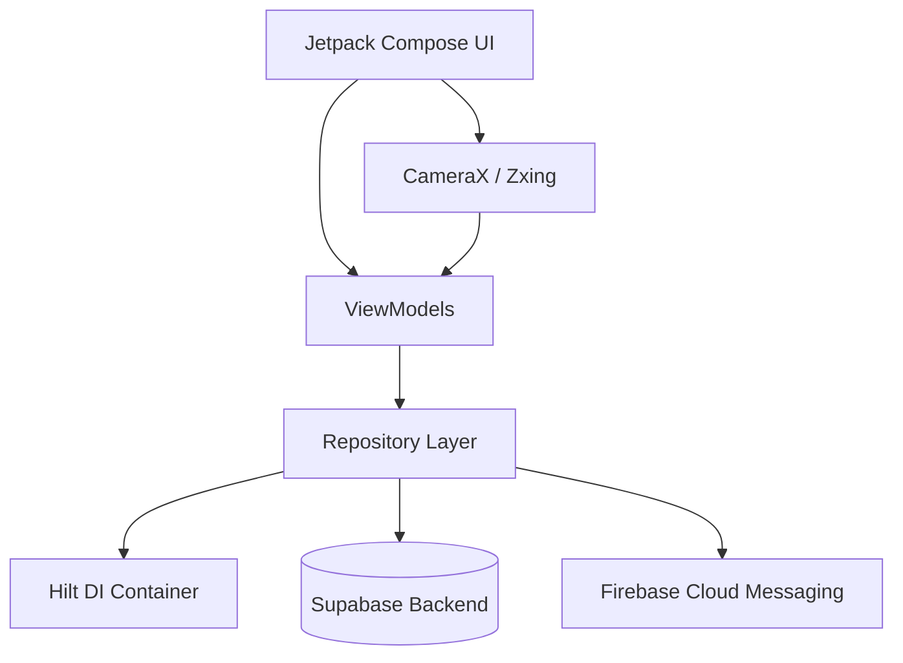
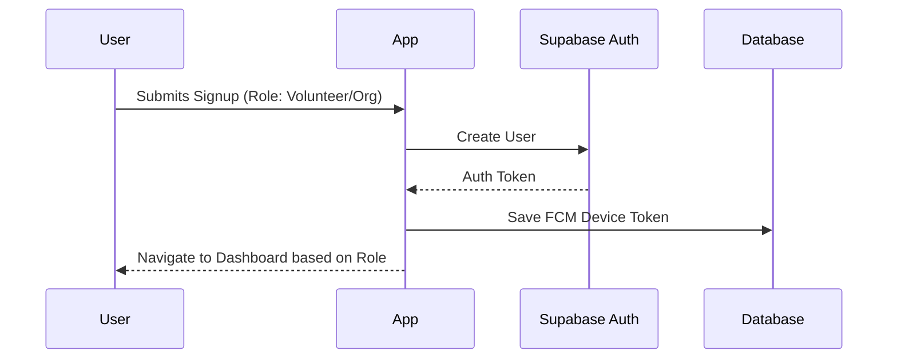
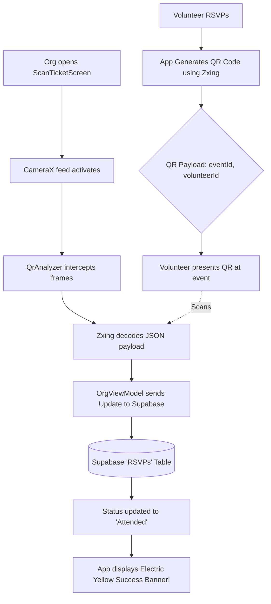

# BaseCamp: The Volunteering App 🏕️

BaseCamp is a high-energy, modern platform designed to bridge the gap between passionate **Volunteers** and community-driven **Organizations**. 

Built entirely with a strict **Neo-Brutalist** design language, BaseCamp rejects the standard, overly-polished corporate aesthetics in favor of raw, bold, and unapologetic UI components. With gamified profiles, instant QR-code ticketing, and real-time hardware scanning, BaseCamp makes community service engaging and frictionless.

---

## 🎯 Why Did We Make It?
Volunteering platforms are often clunky, outdated, and lack the engagement necessary to keep younger demographics coming back. BaseCamp was created to solve this by:
1. **Removing Friction**: Creating a seamless flow from event discovery to physical check-in.
2. **Introducing Gamification**: Rewarding volunteers with earned badges and massive typography showcasing their total impact hours.
3. **Standing Out**: Utilizing a Neo-Brutalist aesthetic (solid black shadows, thick borders, high-contrast Electric Yellows and Hot Pinks) to make the app feel like a modern, premium experience rather than a tedious form.

---

## ⚙️ How Does It Work?

BaseCamp operates on a dual-role system:

### For Volunteers 🤝
1. **Discover**: Browse a real-time feed of local events categorized by cause (Environment, Health, Education, etc.).
2. **RSVP & Ticketing**: RSVP with a single tap. The app instantly generates a unique **QR Code Ticket** containing your secure payload.
3. **Check-In**: Show your digital ticket at the event to be scanned.
4. **Gamification**: Post-event, watch your "Total Hours" climb and unlock achievement badges on your Volunteer Dossier.

### For Organizations 🏢
1. **Event Creation**: Use brutalist forms to easily spin up new community events.
2. **Hardware Scanning**: Access the built-in CameraX scanner to scan volunteer QR tickets at the door.
3. **Real-time Sync**: Scanned tickets instantly update the volunteer's RSVP status to "Attended" in the Supabase backend.

---

## 🛠 Tech Stack

BaseCamp is built using a modern, scalable Android architecture:

*   **Language**: [Kotlin](https://kotlinlang.org/)
*   **UI Toolkit**: [Jetpack Compose](https://developer.android.com/jetpack/compose) (Custom Neo-Brutalist Modifiers)
*   **Architecture**: MVVM (Model-View-ViewModel)
*   **Dependency Injection**: [Dagger Hilt](https://dagger.dev/hilt/)
*   **Routing**: Jetpack Navigation Compose
*   **Backend as a Service (BaaS)**: [Supabase](https://supabase.com/) (PostgreSQL, Authentication) via the official Kotlin SDK.
*   **Hardware Integration**: [Android CameraX](https://developer.android.com/training/camerax) & [Zxing Core](https://github.com/zxing/zxing) for real-time QR generation and decoding.
*   **Push Notifications**: Firebase Cloud Messaging (FCM)

---

## 🗺️ System Flowcharts

### 1. High-Level Architecture

### 2. User Authentication Flow

### 3. The Ticketing & Hardware Scanning Flow
