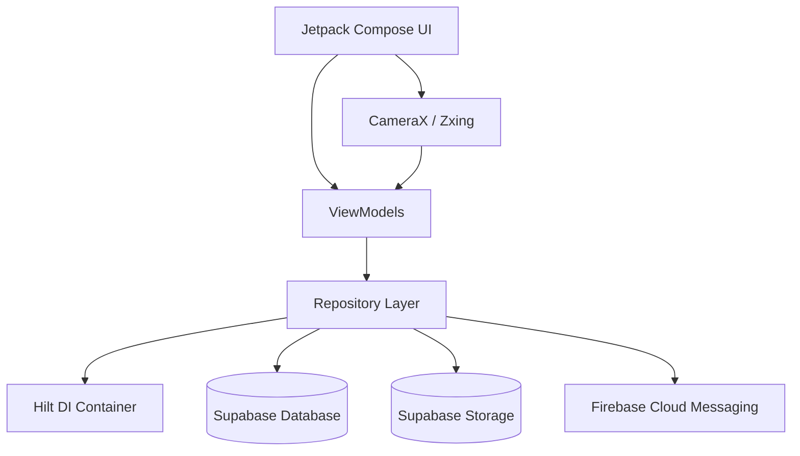
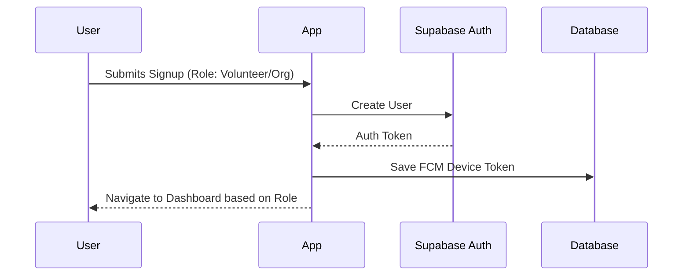
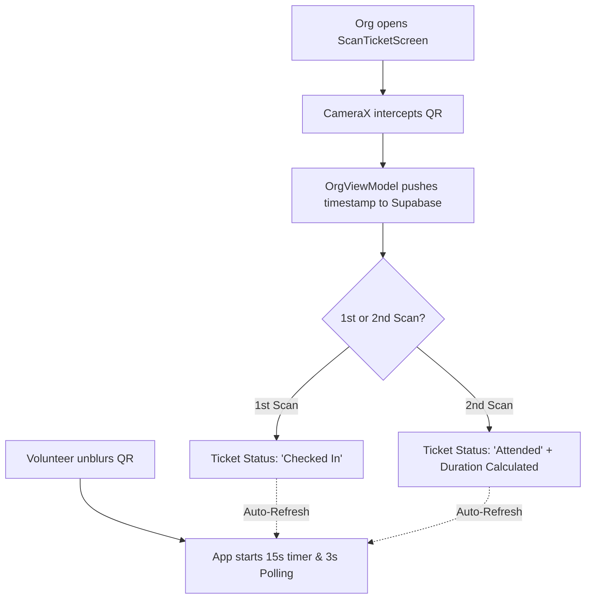
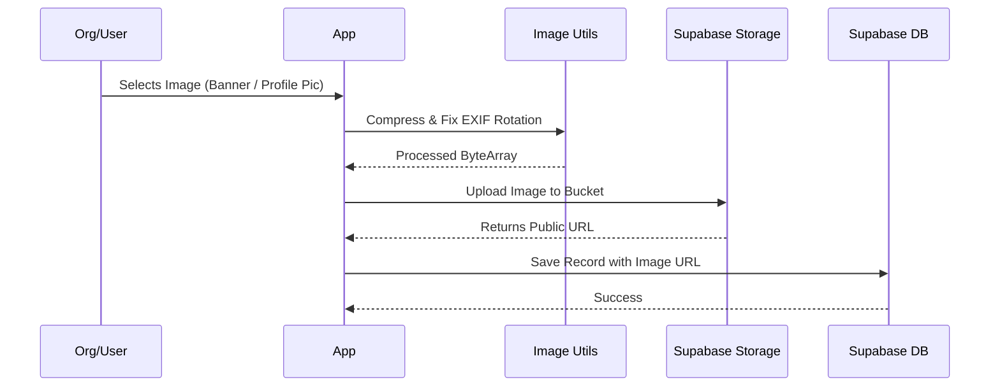

# BaseCamp: The Volunteering App ⛰️

BaseCamp is a high-energy, modern platform designed to bridge the gap between passionate **Volunteers** and community-driven **Organizations**. 

Built entirely with a stunning **Dynamic Glassmorphic** design language and inspired by industry-leading layout structures (like Meetup), BaseCamp combines immersive UI components layered over an animated hardware-accelerated space video background. With gamified profiles, instant QR-code ticketing, and real-time hardware scanning, BaseCamp makes community service engaging and frictionless.

---

## 🛠️ Why did we make it?

Currently in India, there is no dedicated platform for companies or organizations to find volunteers—nor is there a reliable platform for individuals to find local events where they can volunteer. 

The existing ecosystem relies heavily on:
1. **Word-of-mouth** and personal referrals.
2. **WhatsApp channels** that send out irregular, disorganized, and vague updates regarding volunteering events.

BaseCamp was created to fix this fragmentation. We provide a centralized, common platform for both parties. By making the onboarding process incredibly easy, fun, and highly engaging through our Glassmorphic design, BaseCamp aims to solve the volunteering disconnect in India—while building a scalable foundation for future monetization.

---

## ✅ Latest Updates (v1.1.0)
* **Smarter Notifications:** Volunteers now receive specific alerts telling them exactly what changed when an Organization updates an event.
* **Cancel RSVPs:** Volunteers can now seamlessly cancel their RSVPs. They are prompted for a reason, which is automatically forwarded to the hosting Organization.
* **Instant RSVP Alerts:** Organizations now receive instant notifications the moment a Volunteer RSVPs for their event. 
* **Dynamic Comment Sync:** If a user updates their profile name, their new name instantly syncs across all their previous event comments.
* **UI Polish:** 
  * "My Badges" Gamification overhaul with glassmorphism matching.
  * Unified bottom navigation spacing across roles.
  * Sleek new Create Event button styling.
  * Removed strict restrictions on Event creation forms.

---

## 🚀 Key Features

### For Volunteers 🙋
1. **Discover**: Browse a real-time, auto-refreshing feed of local events categorized by cause using clean, horizontal scrolling pills (All Events, My RSVPs).
2. **Secure Ticketing**: RSVP with a single tap. The app generates a **Secure QR Code Ticket** that is blurred by default. Tapping it starts a 15-second interactive reveal timer.
3. **Two-Step Check-In**: Show your ticket to be scanned twice (Login and Logout). The app actively polls the server and instantly updates your status and displays your **total logged duration**.
4. **Interactive Profile**: Upload a profile photo directly to Supabase Storage, watch your "Total Hours" climb, and unlock achievement badges on your Volunteer Dossier.
5. **Interactive Chat**: Engage with other volunteers and organizers in the real-time event chat.

### For Organizations 🏢
1. **Event Management**: Create, edit details, delete, and dynamically increase capacity for community events using a premium, Meetup-inspired card layout.
2. **Hardware Scanning**: Access the built-in CameraX scanner to scan volunteer QR tickets at the door.
3. **Real-time Live Sync**: The "Volunteers" tab auto-refreshes every 10 seconds. When you scan a ticket, it instantly registers the volunteer's check-in/check-out time and automatically calculates their volunteering duration.
4. **Organizer Badges**: Chat directly with volunteers in the event thread—your messages are highlighted with an exclusive "ORGANIZER" badge.

---

## 💻 Tech Stack

BaseCamp is built using a modern, scalable Android architecture:

*   **Language**: [Kotlin](https://kotlinlang.org/)
*   **UI Toolkit**: [Jetpack Compose](https://developer.android.com/jetpack/compose) (Custom Glassmorphism Modifiers)
*   **Media**: [ExoPlayer (Media3)](https://developer.android.com/media/media3) for high-performance, hardware-accelerated looping video backgrounds.
*   **Architecture**: MVVM (Model-View-ViewModel)
*   **Dependency Injection**: [Dagger Hilt](https://dagger.dev/hilt/)
*   **Routing**: Jetpack Navigation Compose
*   **Backend as a Service (BaaS)**: [Supabase](https://supabase.com/) (PostgreSQL, Authentication, and Storage) via the official Kotlin SDK.
*   **Hardware Integration**: [Android CameraX](https://developer.android.com/training/camerax) & [Zxing Core](https://github.com/zxing/zxing) for real-time QR generation and decoding.
*   **Push Notifications**: Firebase Cloud Messaging (FCM)

---

## 📊 System Flowcharts

### 1. High-Level Architecture


### 2. User Authentication Flow


### 3. The 2-Step Ticketing & Hardware Scanning Flow


### 4. Image Processing & Storage Flow


---

## ⚙️ Local Setup & Installation

If you want to clone this repository and run BaseCamp locally, follow these steps to set up your environment and database!

### 1. Supabase Backend Setup
You will need a free [Supabase](https://supabase.com/) project to act as the backend.
1. Create a new project in Supabase.
2. Go to the **SQL Editor** and run the following queries to build your tables and set up security:

```sql
-- 1. Create Users Table
create table public.users (
  id uuid primary key references auth.users(id),
  created_at timestamp with time zone default now(),
  name text not null,
  role text not null check (role in ('Volunteer', 'Organization')),
  email text not null,
  phone text,
  website text,
  profile_image_url text
);

-- 2. Create Events Table
create table public.events (
  id uuid primary key default gen_random_uuid(),
  created_at timestamp with time zone default now(),
  org_id uuid not null references public.users(id),
  title text not null,
  description text,
  cause text not null,
  location text not null,
  date text not null,
  org_name text not null,
  max_volunteers integer default 0,
  type_of_work text,
  payment text,
  dress_code text,
  contact_details text,
  location_link text,
  is_multi_day boolean default false,
  end_date text,
  banner_url text
);

-- 3. Create Tickets Table
create table public.tickets (
  id uuid primary key default gen_random_uuid(),
  created_at timestamp with time zone default now(),
  event_id uuid not null references public.events(id) on delete cascade,
  volunteer_id uuid not null references public.users(id),
  status text default 'Pending',
  check_in_time text,
  check_out_time text
);

-- 4. Create Comments Table
create table public.comments (
  id uuid primary key default gen_random_uuid(),
  created_at timestamp with time zone default now(),
  event_id uuid not null references public.events(id) on delete cascade,
  user_id uuid not null references public.users(id),
  parent_id uuid references public.comments(id) on delete cascade,
  text text not null
);

-- 5. Create Comment Likes Table
create table public.comment_likes (
  id uuid primary key default gen_random_uuid(),
  created_at timestamp with time zone default now(),
  comment_id uuid not null references public.comments(id) on delete cascade,
  user_id uuid not null references public.users(id),
  unique(comment_id, user_id)
);

-- 6. Create Notifications Table
create table public.notifications (
  id uuid primary key default gen_random_uuid(),
  created_at timestamp with time zone default now(),
  user_id uuid not null references public.users(id) on delete cascade,
  title text not null,
  message text not null,
  is_read boolean default false
);
`

### Table Explanations
*   **users**: Stores the core profile data for both Volunteers and Organizations. Links directly to Supabase Auth and holds profile image URLs, phone numbers, and websites.
*   **events**: Contains all details for community events created by Organizations, including capacity (max_volunteers), cause, and banner images.
*   **tickets**: Manages RSVPs and attendance. Links a Volunteer to an Event and tracks check-in/check-out timestamps to automatically calculate their volunteering duration.
*   **comments & comment_likes**: Powers the real-time interactive chat on event pages, supporting nested replies (parent_id) and user likes.
*   **notifications**: Stores dynamic in-app alerts (e.g., when an Organization updates an event's details or when a Volunteer RSVPs/Cancels).``
### 2. Supabase Storage Setup
The app uses Supabase Storage for profile pictures.
1. In your Supabase Dashboard, go to **Storage**.
2. Click **New bucket** and name it exactly: `profile_pics` (lowercase).
3. Set the bucket to **Public**.
4. Go to the **Policies** tab for Storage.
5. Create the first policy for `profile_pics` (For Uploading):
   - Name: `Allow Uploads`
   - Allowed Operations: **SELECT, INSERT, UPDATE**
   - Target Roles: **authenticated**
6. Create the second policy for `profile_pics` (For Viewing):
   - Name: `Allow Public View`
   - Allowed Operations: **SELECT**
   - Target Roles: **public**
7. Save both policies.

8. **Repeat steps 2-7** to create a second bucket named exactly: `event_banners` (lowercase) for event cover photos. Ensure it is also set to **Public** and has both `Allow Uploads` and `Allow Public View` policies configured identically to the profile pictures.

### 3. Configure Local API Keys
For security, Supabase keys are not checked into GitHub. You must add them to a `local.properties` file.

1. Open the Android Studio project.
2. In the root directory of the project, open (or create) the `local.properties` file.
3. Go to your Supabase Project Settings -> **API**.
4. Add your **Project URL** and **anon public key** to `local.properties` like this:

```properties
SUPABASE_URL="https://YOUR_PROJECT_ID.supabase.co"
SUPABASE_KEY="YOUR_ANON_KEY"
```

*Note: Android Studio will automatically generate BuildConfig fields from these properties.*

### 3. Gradle Distribution Note
The `gradle/wrapper/gradle-wrapper.properties` has been updated to use a standard internet distribution url (`https://services.gradle.org/distributions/gradle-8.9-bin.zip`). If you were using a local `file:///` distribution URL, Android Studio should automatically download the standard version upon the first Gradle sync, ensuring the project builds cleanly for any contributor on GitHub!

### 4. Recent Database Patches & Migrations
If you are updating from an older version of the schema, you may need to run these patch scripts to configure the storage buckets, enable Row Level Security for notifications, and add missing columns to the users table.

`sql
-- 1. Create Profile Pics Bucket
insert into storage.buckets (id, name, public) 
values ('profile_pics', 'profile_pics', true);

-- Profile Pics: Master Access
create policy "Master Access profile_pics"
on storage.objects
for all
using ( bucket_id = 'profile_pics' )
with check ( bucket_id = 'profile_pics' );

-- 2. Delete any existing restrictive policies on the banners bucket to start fresh
drop policy if exists "Public Access" on storage.objects;
drop policy if exists "Upload Access" on storage.objects;
drop policy if exists "Master Access event_banners" on storage.objects;

-- 3. Create one master policy for Event Banners that allows INSERT, UPDATE, DELETE, and SELECT for everyone
create policy "Master Access event_banners"
on storage.objects
for all
using ( bucket_id = 'event_banners' )
with check ( bucket_id = 'event_banners' );

-- 4. Notifications RLS Enablement
alter table public.notifications enable row level security;

create policy "Users can view their own notifications"
on public.notifications for select
using (auth.uid() = user_id);

create policy "Authenticated users can insert notifications"
on public.notifications for insert
with check (auth.role() = 'authenticated');

create policy "Users can update their own notifications"
on public.notifications for update
using (auth.uid() = user_id);

create policy "Users can delete their own notifications"
on public.notifications for delete
using (auth.uid() = user_id);

-- 5. Add missing columns to the users table
alter table public.users add column if not exists profile_image_url text;
alter table public.users add column if not exists avatar_url text;
alter table public.users add column if not exists phone text;
alter table public.users add column if not exists website text;
`
